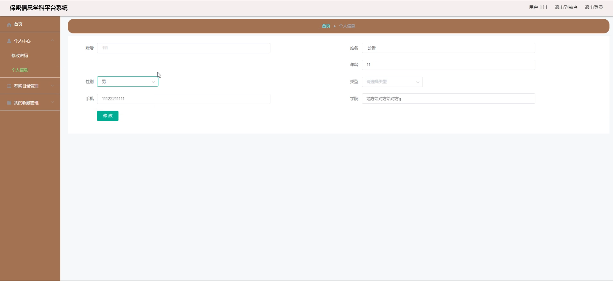
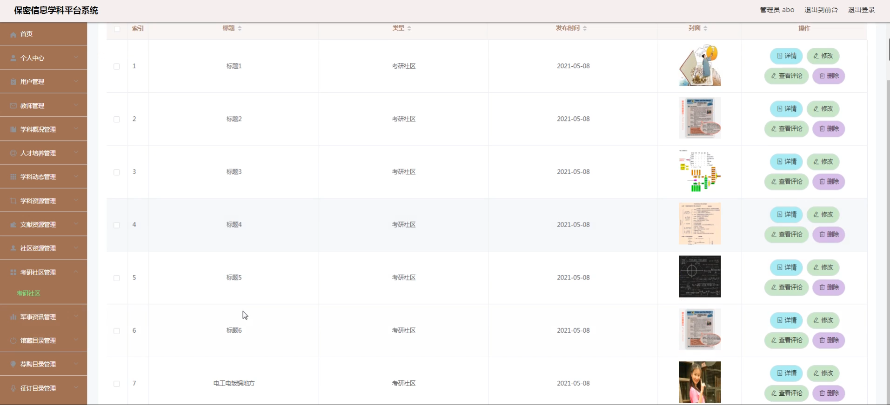

# 基于springboot的信息学科平台系统

---
### 👉作者QQ ：1556708905 微信：zheng0123Long (支持定制修改、部署调试、定制毕设)

### 👉接网站建设、小程序、H5、APP、各种系统等

---

#### 介绍

随着信息技术的快速发展和信息安全需求的日益增长，保密信息学科的重要性愈发凸显。为了更好地促进保密信息学科的教学、研究和交流，我们开发了这个基于 Spring Boot 的保密信息学科平台系统。该系统旨在为管理端、教师端和学生端提供全面、便捷、高效的服务，以推动保密信息学科的发展。

#### 技术栈

后端技术栈：Springboot+Mysql+Maven

前端技术栈：Vue+Html+Css+Javascript+ElementUI

开发工具：Idea+Vscode+Navicate

#### 系统功能介绍

（一）管理端  
个人中心：管理端人员可以查看和修改个人信息，接收系统通知和重要消息。  
用户管理：对平台的所有用户进行注册审核、信息维护、权限设置等操作，保障用户的合法性和安全性。  
教师管理：负责教师的信息登记、教学任务安排、教学质量评估等管理工作。  
学科概况管理：编辑和更新保密信息学科的整体介绍、发展历程、研究方向等内容。  
人才培养管理：制定和调整人才培养方案，包括课程设置、实践教学安排、考核标准等。  
学科动态管理：发布和更新学科的最新研究成果、学术会议、行业动态等信息，让用户及时了解学科前沿。  
学科资源管理：整合和管理与保密信息学科相关的教学资源，如课件、案例、实验数据等。  
文献资源管理：收集、整理和分类各类学术文献，方便用户查阅和下载。  
社区资源管理：监督和维护学科社区的交流内容，确保交流的规范性和有效性。  
考研社区管理：为考研学生提供相关信息和交流平台，包括院校信息、备考经验等。  
军事资讯管理：发布和更新与保密信息学科相关的军事资讯，拓宽用户的视野。  
馆藏目录管理：管理平台的馆藏图书和资料目录，方便用户查询和借阅。  
荐购目录管理：处理用户的图书和资料荐购请求，优化馆藏资源。  
征订目录管理：制定和管理图书、资料的征订计划和目录。  
留言板管理：及时回复和处理用户在留言板上的留言和反馈，提升用户满意度。  
系统管理：进行系统的配置、维护和升级，保障系统的稳定运行。  

（二）教师端  
学科动态：查看和发布学科的最新动态和研究进展。  
学科资源：上传和分享教学资源，获取其他教师的优质资源。  
文献资源：查阅和推荐相关学术文献，辅助教学和研究。  
社区资源：参与学科社区的讨论和交流，分享教学经验和见解。  
考研社区：为考研学生提供指导和建议。  
军事资讯：获取和传播与学科相关的军事资讯。  
留言反馈：向管理端提出意见和建议，与学生进行互动交流。  
个人中心：编辑个人资料，查看教学任务和工作通知。  
后台管理  
荐购目录管理：提出图书和资料的荐购需求。  
我的收藏管理：管理自己收藏的学科资源、文献等。  

（三）学生端  
学科动态：了解学科的最新发展和动态。  
学科资源：获取学习所需的各类教学资源。  
文献资源：查阅学术文献，支持学习和研究。  
社区资源：在社区中与同学和教师交流学习心得和问题。  
考研社区：获取考研信息和经验，与考研同学互动。  
军事资讯：拓宽知识面，了解相关军事领域的动态。  
留言反馈：向教师和管理端提出问题和建议。  
个人中心：修改个人信息，查看学习记录和通知。  
后台管理  
我的收藏管理：收藏感兴趣的学科资源和文献。  

#### 系统作用

1. 提升教学质量和效果  
为教师提供丰富的教学资源和便捷的交流平台，促进教学方法的创新和教学质量的提升。  
方便学生获取优质的学习资源，自主学习和拓展知识，提高学习效果。  
2. 促进学科研究和发展  
及时发布学科动态和研究成果，促进学术交流和合作，推动学科的研究进展。  
整合各类学科资源和文献，为科研人员提供有力支持，提升学科的研究水平。  
3. 加强人才培养和管理  
完善的人才培养管理功能，有助于制定科学合理的培养方案，提高人才培养的质量和针对性。  
对学生的学习情况进行跟踪和评估，为个性化培养提供依据。  
4. 优化资源管理和利用  
实现对学科资源、文献资源、社区资源等的有效管理和整合，提高资源的利用效率。  
通过荐购目录和征订目录管理，满足用户的个性化需求，丰富平台的资源内容。  
5. 增强互动和沟通  
留言反馈功能和社区交流平台，促进了师生之间、学生之间的互动和沟通，营造良好的学习氛围。  
管理端能够及时了解用户需求和意见，不断优化平台服务。  
  
#### 系统功能截图

代码结构

数据库表

登录

用户端后台管理

荐购目录管理

管理员端用户管理

教师管理

学科动态管理

学科资源管理

社区资源管理

考研社区管理

系统管理

前台页面首页

我的收藏管理

教师端后台管理

#### 总结

本基于 Spring Boot 的保密信息学科平台系统，通过明确的角色划分和丰富的功能模块，为保密信息学科的教学、研究和交流提供了全面的支持。它不仅提升了学科管理的效率和科学性，也为教师的教学和科研工作、学生的学习和成长创造了有利条件。未来，我们将持续改进和完善该系统，以适应学科发展的新需求和新趋势，为保密信息学科的繁荣发展做出更大的贡献。

#### 使用说明

创建数据库，执行数据库脚本 修改jdbc数据库连接参数 下载安装maven依赖jar 启动idea中的springboot项目

后台地址：http://localhost:8080/springbooto97z9/admin/dist/index.html

管理员  abo 密码 abo

前台地址：http://localhost:8080/springbooto97z9/front/index.html

